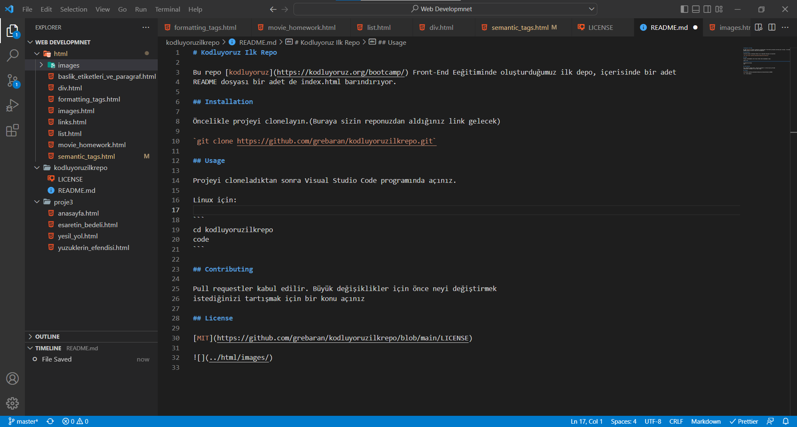

# Kodluyoruz Ilk Repo

Bu repo [kodluyoruz](https://kodluyoruz.org/bootcamp/) Front-End Eeğitiminde oluşturduğumuz ilk depo, içerisinde bir adet
README dosyası bir adet de index.html barındırıyor.

## Installation

Öncelikle projeyi clonelayın.(Buraya sizin reponuzdan aldığınız link gelecek)

`git clone https://github.com/grebaran/kodluyoruzilkrepo.git`

## Usage

Projeyi cloneladıktan sonra Visual Studio Code programında açınız.

Linux için:

```
cd kodluyoruzilkrepo
code
```

## Contributing

Pull requestler kabul edilir. Büyük değişiklikler için önce neyi değiştirmek
istediğinizi tartışmak için bir konu açınız

## License

[MIT](https://github.com/grebaran/kodluyoruzilkrepo/blob/main/LICENSE)


